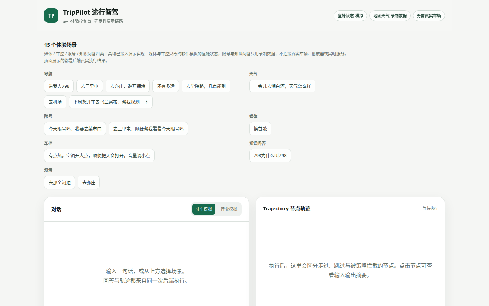
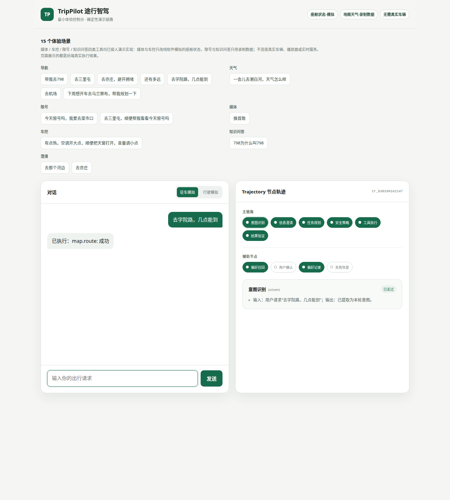

# TripPilot｜途行智驾

这是一个跑在北京真实出行任务上的语音优先座舱 Agent 原型——车是假的（纯软件模拟），但轨迹评测是真的。

完整产品计划见 `~/workspace/goals/goal/files/车企Agent项目计划.md`。技术规范（代码风格、commit 规范、决策记录铁律）见 `AGENTS.md`，那是写代码的人看的，这份是看项目的人看的。

## 在线体验 demo

这是一个点开链接就能玩的座舱 Agent：输入一句话，看它怎么拆任务、走 trajectory。

在线链接：（部署后填链接）

- 车况是纯软件模拟，不来自真车。
- 地图和天气使用录制数据，不代表实时结果。
- 无需 API key，打开即玩。

首页全景：



一条场景问答的 trajectory 时间线：



## 项目状态

- **v0.1 脚手架 ✅ 落地**：intent→clarify→planner→policy_gate→confirm→tools→verifier→recovery 主循环全跑通，68 个测试全绿，轨迹级回归 12 条全过。
- **Day 1 用户偏好记忆 ✅ 落地**：qdrant 本地文件模式（无 server，clone 即跑），向量召回语义偏好，敏感偏好写入前走 Memory Gate 确认。取舍记录见 `docs/decisions/20251005-qdrant-preference-memory.md`。
- **对话自动抽取记忆候选 ✅ 落地**：规则式抽取（`trippilot/memory/extract.py`），16 条 fixture 上 P/R=1.000，12 条对抗探针已定位 4 类误抽模式（见 `docs/experiments/20251005-extraction-pr.md`）。
- **评测集 ✅ 扩到 12 条**：`fixtures/dataset_v0.jsonl`（见 `docs/decisions/20251005-eval-dataset-v1.md`）。
- **harness 事件溯源审计 ✅ 常驻回归**：`eval/harness_audit.py`，model-visible ⟺ logged 不变式 + 工具注册表 AST 门禁（见 `docs/decisions/20251005-harness-dsh.md`）。
- **DeepSeek judge 🔧 接入中**：key 待开通，开通后轨迹评测接真实模型打分，现在还是确定性 stub。

> **诚实边界**：车况（驻车/行驶）全部为**纯软件模拟**，不宣称来自真实车辆；
> 地图/天气默认走**录制响应**（`fixtures/recorded/`），不代表实时数据；
> 无 key 时 LLM 为**确定性 stub**，只保证主循环跑通，不充当模型能力。

## 目录

```
trippilot/            # 主包
  state.py            # LangGraph 显式 Pydantic 状态（append-only 轨迹）
  policy_gate.py      # 确定性 ABAC Policy Gate + Memory Gate + 注入检查
  graph.py            # intent→clarify→planner→policy_gate→confirm→tools→verifier→recovery
  llm.py              # LLM 接口：DeterministicStub / ScriptedLLM / EnvLLMClient（手动 key）
  memory/             # 用户偏好记忆（qdrant 本地文件模式；单进程）
  api.py              # FastAPI 会话 API（trace_id、脱敏日志）
  voice.py            # ASR/TTS 接口（stub；FunASR/Whisper 实测接入点已留 TODO）
  tools/              # map / weather / reminder（幂等）/ trip_log；recorded/live_manual 双轨
fixtures/
  policy_matrix.yaml  # ABAC 策略表（对照 policy_gate.py 评审用）
  dataset_v0.jsonl    # 12 条轨迹评测集：多工具/歧义/低置信拦截/行驶降级/记忆门/澄清/幂等/恢复
  memory_recall_cases.jsonl  # 偏好召回评测（query → 期望命中）
  recorded/           # 版本化录制响应
eval/eval_runner.py   # 轨迹级回归：必经节点/禁止动作/确认合规/deny-degrade/记忆召回断言
tests/                # 68 个单元+冒烟测试
docs/decisions/       # 技术取舍记录（没记录不许合入，这是铁律）
web/index.html        # 最小控制台：文本输入、确认卡片、模拟车况切换
```

## 快速开始

```bash
cd ~/workspace/your_files/trippilot
python3 -m venv .venv && .venv/bin/pip install -e ".[dev]"

# 1. 单元测试（68 个）
.venv/bin/python -m pytest tests/ -q

# 2. 轨迹级回归（12 条）+ harness 审计
.venv/bin/python eval/eval_runner.py
.venv/bin/python eval/harness_audit.py

# 3. 启动 API + 控制台
.venv/bin/uvicorn trippilot.api:app --port 8130 &
# 浏览器打开 web/index.html（或反代 /turn 到 8130）
```

注意：首次跑记忆相关代码会下载 FastEmbed 模型（约 100MB），离线环境召回会失败——测试里用确定性 fake embedder，CI 离线可跑。

## 关键设计（对照计划 §③）

- **Policy Gate 不经过模型**：`deny` 直接短路到 verifier，`confirm` 走人工确认；
  地点歧义在 clarify 已解决后不再重复拦截。
- **低 ASR 置信度禁止副作用**：阈值 0.6（`policy_gate.LOW_CONFIDENCE_THRESHOLD`）。
- **提醒幂等**：`reminder.create` 用 `sha1(content|time|session)` 幂等键，
  重试返回首次结果，不重复写入（Duplicate Side-effect Rate 第一道防线）。
- **工具返回先过注入检查**：命中模式 → 该次结果记失败并拦截，不进入系统指令。
- **双轨地图**：自动回归只读 recorded；真实接口需手动设
  `TRIPPILOT_AMAP_KEY_TEMP`（transient use，用后即删，不写入文件）后触发
  `live_manual`。
- **真实模型**：手动设置 `TRIPPILOT_LLM_BASE_URL/_API_KEY/_MODEL` 后
  `make_llm()` 自动切换；key 只存进程环境。

## 下一步（按计划第 1 周）

1. 回溯你最近 10 次真实出行 → 扩充 `dataset_v0.jsonl` 到 25–30 条；
2. 录制 5–8 个地图/天气 fixture（脱敏后的真实任务参数）；
3. 接入 FunASR/Whisper 实测 WER（`trippilot/voice.py` TODO 处）；
4. 把策略表拿给朋友做一次红队 review（越权/prompt 注入变体）。
